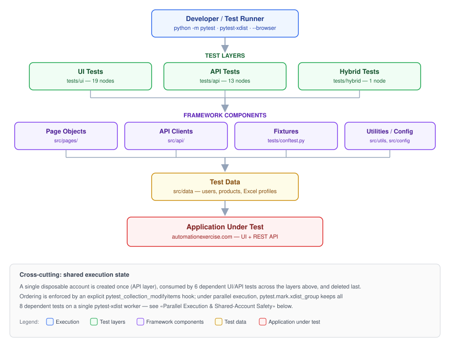
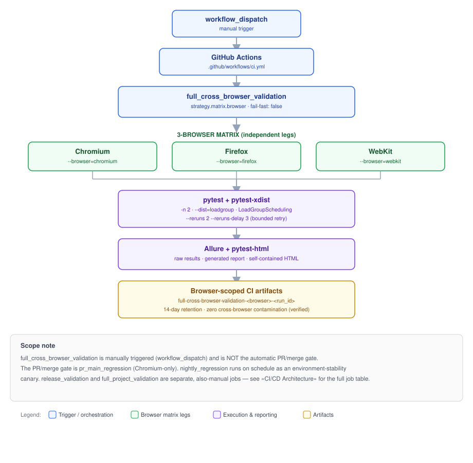
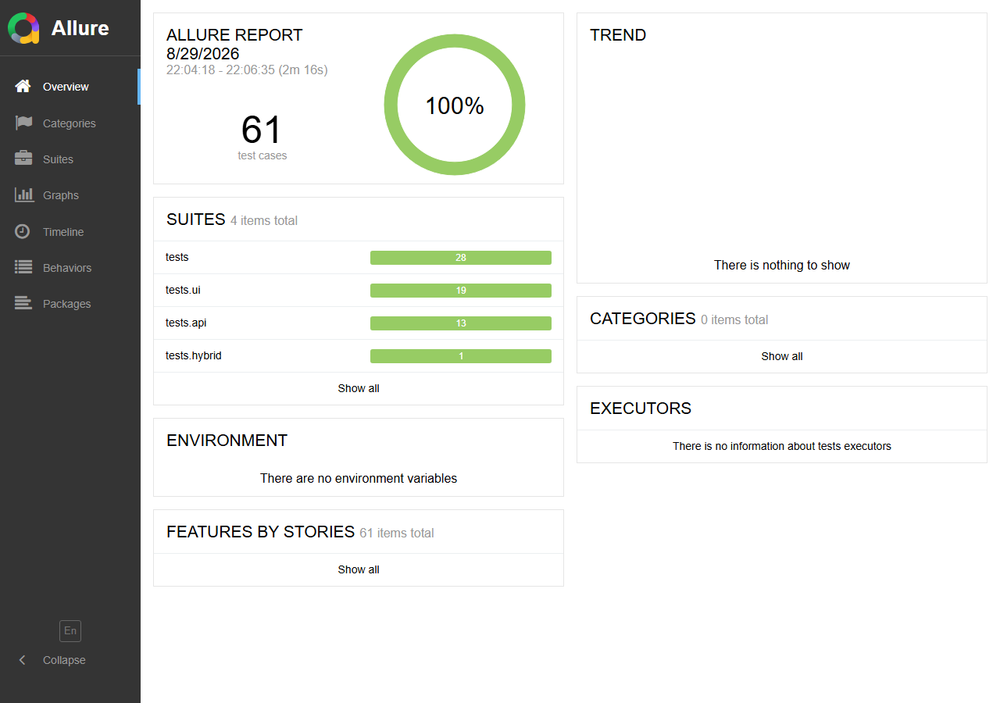
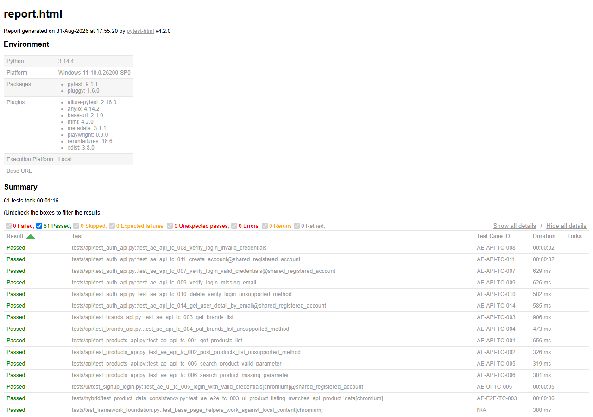

# Playwright + Python Hybrid Automation Framework

A hybrid UI + API + E2E test automation framework for [automationexercise.com](https://automationexercise.com), engineered and validated through a staged, evidence-driven CI/CD reliability program spanning cross-browser execution, safe parallelization, and real GitHub Actions validation.

[](https://github.com/SharifulIslamSabuj/playwright-python-hybrid-framework/actions/workflows/ci.yml)


---

## At a Glance

| Attribute | Detail |
|---|---|
| Language | Python ≥ 3.11 |
| Automation library | Playwright 1.62.0 (`pytest-playwright` 0.9.0) |
| Test runner | pytest 9.1.1 |
| Browser coverage | Chromium, Firefox, WebKit |
| Test layers | UI, API, Hybrid (UI + API cross-validation) |
| Total collected tests | 61 (33 business regression cases + 28 framework/infrastructure checks) |
| CI cross-browser collection | 58 per browser leg (61 minus 3 all-engine infrastructure checks — see [Test Architecture & Scope](#test-architecture--scope)) |
| Parallel execution | `pytest-xdist`, 2 workers, `--dist=loadgroup` |
| CI/CD | GitHub Actions — 5 jobs, including a real 3-browser matrix |
| Reporting | Allure (raw + generated) and `pytest-html` |
| Artifact handling | Browser- and run-scoped GitHub Actions artifacts, 14-day retention |
| Validation status | Formally closed — **READY WITH KNOWN INTERMITTENT RISK** |

---

## Overview

This framework automates [Automation Exercise](https://automationexercise.com), a public demo e-commerce site used as a stable, real-world target for building and validating a production-shaped test automation system.

**Why Playwright + Python.** Playwright provides a single, modern automation API across Chromium, Firefox, and WebKit with native auto-waiting, removing an entire class of flaky-selector problems. Python was chosen for its mature `pytest` ecosystem, straightforward `httpx`-based API testing, and easy integration with data tooling (`openpyxl`) and CI tooling.

**What "Hybrid" means here.** The framework runs three distinct test layers against the same target — pure UI tests (Playwright + Page Object Model), pure API tests (`httpx` clients), and a dedicated Hybrid test that cross-validates data rendered in the UI against the same data returned by the API — rather than treating UI and API testing as separate, disconnected efforts.

**The engineering problem this project addresses.** Most portfolio automation projects stop at "tests pass locally." This one was deliberately extended into a full CI/CD engineering exercise — designing a safe parallel execution model, proving it under real GitHub-hosted runners, isolating reporting and artifacts across concurrent browser legs, and documenting exactly what was proven versus what remains a known, accepted risk.

---

## Engineering Philosophy

- **Evidence before assumptions.** Every classification of a test failure (framework defect vs. environmental instability vs. known browser-specific risk) was made from re-run evidence, not guessed from a single failure.
- **Thin test orchestration, explicit separation of concerns.** Tests contain assertions and flow; Page Objects encapsulate UI interaction; API clients encapsulate HTTP interaction; neither layer leaks into the other.
- **Explicit shared-state control.** The one genuine cross-test dependency in this suite — a disposable shared account used by several tests — is managed by an explicit, documented ordering/grouping mechanism, not implicit test-file ordering.
- **Cross-browser isolation as a first-class requirement.** Reports and artifacts are scoped per browser by design, not merely by convention, and that isolation was independently verified at the content level.
- **Failure evidence preservation.** Screenshots, Playwright traces, and structured Allure results are captured on genuine failure and are never discarded before analysis.
- **Honest risk reporting.** A real, intermittent WebKit timing issue is documented, tracked, and left unresolved rather than hidden behind a retry.
- **Controlled change and re-validation.** Every load-bearing CI/execution mechanism is documented with an explicit rule: change it only alongside the matching re-validation (see [`docs/19-CI-CD.md`](docs/19-CI-CD.md)).

---

## Key Engineering Decisions

1. **A cross-browser CI matrix validated on real GitHub-hosted runners** — not just asserted to work locally.
2. **Parallel execution with a provably safe shared-account lifecycle** — a session-scoped disposable account is created once, consumed by several dependent tests, and deleted last, guaranteed to stay on a single `pytest-xdist` worker via an explicit grouping mechanism.
3. **Browser-isolated CI reporting and artifacts** — independently verified to produce zero cross-browser contamination across three concurrently running matrix legs.
4. **A byte-verified failure-evidence chain** — a real WebKit failure was captured end-to-end (failed Allure result → retry → passed result → screenshot → valid trace archive → correctly-isolated CI artifact) and used as documented proof, not a hypothetical description.
5. **A staged, phase-gated validation program** — design → implement → validate → observe → document → control future change — rather than "write tests until they pass."
6. **An evidence-driven, honestly preserved risk register**, instead of silently retrying or hiding intermittent failures.
7. **Formal operational and change-control documentation** for future maintainers, not just a working pipeline.

---

## Technology Stack

| Layer | Technology |
|---|---|
| Language | Python ≥ 3.11 |
| Browser automation | Playwright 1.62.0 (`pytest-playwright` 0.9.0) |
| Test runner | pytest 9.1.1 |
| Parallel execution | `pytest-xdist` 3.8.0 |
| Retry / fault tolerance | `pytest-rerunfailures` 16.6 |
| API testing | `httpx` 0.28.1 |
| Test data | `openpyxl` 3.1.5 (Excel-sourced registration profiles), `python-dotenv` 1.2.3 |
| Reporting | `allure-pytest` 2.16.0 + Allure CLI, `pytest-html` 4.2.0 |
| CI/CD (executed) | GitHub Actions |
| CI/CD (defined, not externally executed) | Jenkins (`Jenkinsfile`), Azure DevOps (`azure-pipelines.yml`) |
| Package management | `pip`, driven directly from `pyproject.toml`'s `[project.dependencies]` (no packaging/build-system metadata) |
| Version control | Git / GitHub |

---

## Architecture Overview



The framework separates orchestration from implementation: **tests** contain assertions and flow only; **Page Objects** (`src/pages/`) encapsulate UI interaction; **API clients** (`src/api/`) encapsulate HTTP interaction; **fixtures** (`tests/conftest.py`) wire everything together, including the shared-account lifecycle; **test data** (`src/data/`) is fully decoupled from both. Neither layer leaks into the other — Page Objects and API clients contain no test assertions.

| Capability | Implementation |
|---|---|
| UI Automation | Page Object Model, `src/pages/` — 19 test nodes |
| API Automation | Stateless `httpx` clients, `src/api/` — 13 test nodes |
| Hybrid Automation | UI ↔ API cross-validation, `tests/hybrid/` — 1 test node |
| Cross-Browser Execution | Chromium, Firefox, WebKit — local and CI matrix |
| Parallel Execution | `pytest-xdist`, `-n 2`, `--dist=loadgroup` |
| Shared-State Safety | Disposable account lifecycle, `xdist_group` + ordering hook |
| Failure Handling | Screenshot + trace on failure, bounded CI retry |
| Reporting | Allure (raw + generated) + `pytest-html` |
| CI/CD | GitHub Actions, 5 jobs including a real 3-browser matrix |
| Artifact Management | Browser- and run-scoped GitHub Actions artifacts |

---

## Test Architecture & Scope

- **UI layer** (`tests/ui/`) drives the browser through Page Objects; assertions live in the tests, not the Page Objects.
- **API layer** (`tests/api/`) exercises the AUT's REST API directly via `httpx`, independent of any browser.
- **Hybrid layer** (`tests/hybrid/`) reads the same underlying data through both the UI and the API in one test and asserts they agree.
- **Fixtures** (`tests/conftest.py`) provide Page Object instances, API client instances, settings, and the shared-account lifecycle — kept in one place so tests remain declarative.

| Scope | Count |
|---|---|
| **Total tests collected in the repository** | **61** |
| — UI-layer tests | 19 |
| — API-layer tests | 13 |
| — Hybrid tests | 1 |
| — Business regression total (`regression` marker) | 33 |
| — Tier-1 framework/infrastructure checks (no business marker) | 28 |
| `smoke`-marked | 7 |
| `cross_browser`-marked (curated subset) | 5 |
| `ci_restricted`-marked nodes (account-mutating; 3 underlying business cases) | 5 |
| `negative`-marked | 9 |
| `requires_all_browsers`-marked (one-time, all-3-engine infra check) | 3 |

**CI collection differs from the repository total.** The `full_cross_browser_validation` job runs `-m "not requires_all_browsers"`, so each of its browser legs collects **58** tests, not 61 — the 3 excluded nodes need all three browser engines installed in a single job (each CI matrix leg installs only one), and that responsibility belongs exclusively to the `full_project_validation` job instead. No other job filters differently on this project's own terms; see [`docs/19-CI-CD.md §18.1`](docs/19-CI-CD.md) for the exact accounting.

There is no configured code-coverage measurement tool in this repository — the figures above describe automation *scope* (how many tests exist and what they exercise), not measured source-code coverage.

---

## Cross-Browser Strategy

Chromium, Firefox, and WebKit are exercised both locally and in CI.

- **Local**: `--browser=chromium` is the project's baked-in default. Selecting Firefox or WebKit on the command line requires `--override-ini` rather than a bare `--browser=firefox` flag — `pytest-playwright`'s `--browser` option is additive, so a bare flag accumulates with the baked-in default instead of replacing it, a real defect class this project found and fixed (see [Getting Started](#getting-started)).
- **CI**: the `full_cross_browser_validation` job runs a real `strategy.matrix.browser: [chromium, firefox, webkit]` with `fail-fast: false`, so one browser's failure never cancels the other two.
- **Isolation**: every browser leg writes to its own report and artifact paths (`reports/*/<browser>/`) and uploads its own uniquely-named GitHub Actions artifact — independently verified to produce zero cross-browser contamination.
- **Known risk**: `test_ae_ui_tc_011_view_all_products_and_product_details[webkit]` is an accepted, intermittent WebKit-specific compatibility/timing risk — it has both passed and failed across many independent executions, including real CI, and its root cause has not been conclusively proven. See [Known Risks & Limitations](#known-risks--limitations) and [`docs/19-CI-CD.md §18.5`](docs/19-CI-CD.md) for the full evidence trail.

---

## Parallel Execution & Shared-Account Safety

Parallel execution uses `pytest-xdist` with two flags that matter operationally, not just as CLI trivia:

- **`-n 2`** — two worker processes.
- **`--dist=loadgroup`** — required specifically because a default `load` distribution mode ignores `pytest.mark.xdist_group` entirely. This project has 8 tests that must never be split across workers (they share one disposable account), so `loadgroup` scheduling is not optional once `-n` is used.

Console evidence of correct operation looks like:

```
created: 2/2 workers
2 workers [58 items]
scheduling tests via LoadGroupScheduling
```

**Why `tryfirst=True` matters.** `tests/conftest.py`'s `pytest_collection_modifyitems` hook applies the `xdist_group` marker to the 8 shared-account tests. `pytest-xdist`'s own internal hook (which encodes `xdist_group` into each test's worker-routing key) runs in the same process — without `@pytest.hookimpl(tryfirst=True)`, it could run *before* this project's own hook has added the marker, and would then see nothing to group. This was found empirically during this project's own validation work, not assumed defensively, and is documented in `tests/conftest.py`'s own hook docstring. This is process/worker scheduling and shared-state lifecycle control — not generic "thread safety."

### Shared-Account Lifecycle

```
Creator
  test_ae_api_tc_011_create_account
        │
        ▼
Dependent tests (6)
  test_ae_api_tc_007_verify_login_valid_credentials
  test_ae_api_tc_014_get_user_detail_by_email
  test_ae_ui_tc_005_login_with_valid_credentials
  test_ae_ui_tc_007_logout_from_authenticated_session
  test_ae_ui_tc_008_register_with_already_registered_email
  test_ae_ui_tc_021_search_add_to_cart_persists_after_login
        │
        ▼
Deleter
  test_ae_api_tc_012_delete_account
```

- **Why they must stay grouped**: the shared account is a session-scoped fixture, which under `pytest-xdist` means scoped *per worker process*, not per whole run. If these 8 tests were split across workers, each worker would independently create its own account, breaking the single-shared-account model.
- **How xdist grouping protects them**: every dependent test is tagged `pytest.mark.xdist_group(name="shared_registered_account")`, forcing all 8 onto one worker — `pytest-xdist`'s own documented mechanism for exactly this case.
- **How ordering is controlled**: a custom `pytest_collection_modifyitems` hook sorts by lifecycle phase (creator first, deleter last, everything else preserving its original relative order) — explicit, code-level ordering, not an assumption about file/definition order.
- **If account creation fails**: dependent tests correctly fail or error at setup rather than silently running against a nonexistent account — this exact cascade was directly observed and verified during this project's own real-CI validation work (see [`docs/19-CI-CD.md §18.2`](docs/19-CI-CD.md)).
- **Why this prevents unsafe execution**: no dependent test can ever run before the account exists or after it has been deleted, under either sequential or parallel execution.

---

## CI/CD Architecture



### Workflow Model

Five jobs exist in `.github/workflows/ci.yml`:

| Job | Trigger | Purpose |
|---|---|---|
| `pr_main_regression` | `pull_request → main`, `push → main` | Chromium-only regression gate — **the actual PR/merge gate** |
| `nightly_regression` | `schedule` (`0 2 * * *`) | Full regression including account-mutating cases, Chromium only — an unattended environment-stability canary |
| `release_validation` | `workflow_dispatch` | Chromium full regression + a curated Firefox/WebKit cross-browser subset |
| `full_project_validation` | `workflow_dispatch` | All 61 collected nodes, no marker filter, single-browser execution — the only job that satisfies the all-3-engine infrastructure check |
| `full_cross_browser_validation` | `workflow_dispatch` | The full cross-browser matrix — 58 tests × 3 browsers × 2 xdist workers |

`full_cross_browser_validation` is **manually triggered and not wired into the automatic PR/merge gate** — a deliberate scope boundary from this project's own design phase, not an oversight. Manual dispatch: **Actions → CI → Run workflow** in the GitHub UI, or `gh workflow run CI --ref main` via the GitHub CLI. All three `workflow_dispatch`-triggered jobs fire together from a single manual dispatch.

### Cross-Browser Matrix

`strategy.matrix.browser: [chromium, firefox, webkit]`, `fail-fast: false` — each leg installs exactly one browser engine, runs on its own GitHub-hosted runner, and completes independently of the other two.

### CI Artifacts

| Aspect | Value |
|---|---|
| Naming | `full-cross-browser-validation-<browser>-<run_id>` |
| Report/artifact paths | `reports/{artifacts,allure-results,allure-report,html}/<browser>` |
| Retention | 14 days |
| Isolation | Independently verified — zero cross-browser contamination across every checked evidence type |

---

## Reporting & Observability

### Allure Reporting



> Real Allure execution evidence from this project (a preserved full-suite run), showing browser/suite classification, execution status, and timing — not a mock-up.

Raw per-test JSON results are written to `reports/allure-results/`; a static HTML report is generated into `reports/allure-report/`. Result accounting (passed/failed/broken/skipped) is independently reconciled against the pytest console output in this project's own validation history, including under a real retry event — a retried test's original failed attempt and its eventual passed attempt are both recorded as raw results, and the generated report correctly collapses them into one logical test in its final state.

### pytest-html



> Real pytest-html evidence from this project — a clean 61/61 parallel run, with each row linked to its `AE-*-TC-*` Test Case ID.

A self-contained HTML report (`reports/html/report.html` locally; `reports/html/<browser>/report.html` in the CI matrix), verified to contain real, browser-specific test content with no cross-browser leakage.

### Failure Evidence

- **Screenshot**: captured only on failure (`--screenshot=only-on-failure`).
- **Trace**: retained only for tests that end up failing (`--tracing=retain-on-failure`) — a test that fails and later passes on retry still leaves its original failure's trace behind.
- **Video**: **intentionally disabled by design** — not configured anywhere in this project, and its absence is not a defect.

### Artifact Isolation

Every report type — Allure raw results, generated Allure report, pytest-html, and (on failure) screenshots/traces — is written under a browser-named subdirectory. Every CI artifact name includes `${{ github.run_id }}`, so no two runs' artifacts can ever collide. Isolation was independently checked across every browser pair and every evidence type (Allure JSON, generated report contents, HTML content, artifact directory structure) — zero cross-browser contamination found.

### Where to Find Reports & Artifacts

**Locally**, after any run: `reports/html/report.html` (pytest-html), `reports/allure-results/` (raw Allure — generate a viewable report with `allure generate`/`allure serve`), `reports/artifacts/` (screenshots/traces for any failed test).

**In CI**: open the relevant workflow run under the repository's **Actions** tab; each job uploads its own evidence as a named artifact, downloadable directly from the run's summary page for 14 days.

---

## Failure Handling & Retry Strategy

CI-only, bounded retry: `--reruns 2 --reruns-delay 3`. (Local runs remain retry-free by default — this is a CI-specific policy, not a project-wide default.)

- **Why bounded retry exists**: to absorb transient, environment-layer instability (network resets, timeouts against the shared public AUT) without masking a persistent defect behind unlimited retries.
- **Retry does not prove a defect is fixed.** A real example from this project's own validation history:

  ```
  test_ae_ui_tc_011_view_all_products_and_product_details[webkit]
      FAILED  (first attempt, real CI)
         ↓
      RETRY
         ↓
      PASSED  (second attempt)
  ```

  The failure's evidence — a real screenshot and a valid Playwright trace — was preserved and uploaded regardless of the eventual pass. The underlying intermittent risk (see [Known Risks & Limitations](#known-risks--limitations)) is **not** considered resolved by that pass.
- **Evidence preservation**: failure screenshots and traces are captured before any retry attempt and are never overwritten by a subsequent success.
- **What has not been observed**: a test failing through *all* configured retry attempts, causing a genuine job failure. This scenario has never naturally occurred in this project's CI history and is not claimed to be validated.

---

## Validation Evidence

This framework was validated in stages before being treated as a stable baseline:

- **Local browser validation** — sequential and parallel execution across Chromium, Firefox, and WebKit.
- **Parallel validation** — `pytest-xdist` worker/scheduling behavior confirmed via direct console evidence, not inferred from CLI flags.
- **Real GitHub Actions validation** — 5 independent real workflow triggers, 15 independent browser-leg executions of the `full_cross_browser_validation` job.
- **Reporting validation** — raw Allure, generated Allure, and pytest-html cross-checked for exact numerical agreement.
- **Artifact validation** — archive integrity independently confirmed (Python's `zipfile.testzip()`), UUID uniqueness confirmed across every downloaded result set.
- **Regression validation** — full local sequential and parallel runs across all three browsers.
- **Repeated CI reliability validation** — the same matrix triggered multiple independent times to confirm consistent behavior, not a single lucky run.
- **Final operational readiness** — the architecture was formally closed as an operational baseline with documented change-control rules.

---

## Known Risks & Limitations

| Risk / Limitation | Status | Classification |
|---|---|---|
| WebKit `TC-011` (`test_ae_ui_tc_011_view_all_products_and_product_details[webkit]`) | Open, unresolved | Intermittent WebKit-specific compatibility/timing risk — root cause not conclusively proven |
| Firefox context-teardown race (`Browser.removeBrowserContext` / `_maybeDontRestoreTabs`) | Open, unresolved | Historical single occurrence (one local session) — not reproduced in any subsequent local or real-CI run |
| Persistent CI failure after exhausting all retries | Not observed | NOT PROVEN — this scenario has never naturally occurred; not claimed to be validated |
| `pytest-html` internal structured schema | Partial | Content-level validation only — the internal per-test JSON field schema was never fully parsed |
| Real-CI reliability sample size | Limited | 5 independent triggers / 15 browser-leg executions — meaningful, not exhaustive |

No claim of "no known issues," "100% stable," or "fully reliable" is made anywhere in this project — these limitations are preserved intentionally.

---

## Operational Baseline

| Component | Validated value |
|---|---|
| Browser matrix | `chromium`, `firefox`, `webkit` |
| Worker count | `-n 2` |
| Scheduling mode | `--dist=loadgroup` (`LoadGroupScheduling`) |
| Retry policy | `--reruns 2 --reruns-delay 3` |
| Report/artifact paths | `reports/{artifacts,allure-results,allure-report,html}/<browser>` |
| Artifact naming | `full-cross-browser-validation-<browser>-<run_id>` |
| Shared-account grouping | `xdist_group(name="shared_registered_account")` + `tryfirst=True` ordering hook |
| Account-creation gate | `ACCOUNT_CREATION_EXECUTION_AUTHORIZED` (secret-gated, off by default) |

Any change to a load-bearing component above requires the corresponding re-validation before being trusted — see below.

---

## Change & Re-Validation Policy

The following are treated as **validated — change only with re-validation**: the browser matrix, the `--override-ini` browser-selection mechanism, the `-n 2` worker count, `--dist=loadgroup`, `tryfirst=True`, `shared_registered_account` grouping, the retry policy, browser-scoped report paths, artifact naming, Allure generation, artifact upload paths, the `ACCOUNT_CREATION_EXECUTION_AUTHORIZED` gate, and any Playwright/Python/pytest/pytest-xdist version upgrade.

Validation is **proportional** to the change: a documentation-only edit needs none; a non-load-bearing CI change needs a single confirming run; any component in the list above needs the specific re-check that component's own risk profile requires; a browser/toolchain upgrade follows a dedicated procedure; a security-sensitive change (the authorization gate) requires explicit re-authorization, not just a technical re-test.

The full rationale, per-component detail, and upgrade procedure are documented in [`docs/19-CI-CD.md §18–§19`](docs/19-CI-CD.md).

---

## Repository Structure

```
playwright-python-hybrid-framework/
├── .github/workflows/ci.yml
├── docs/                         23 numbered engineering documents
├── src/
│   ├── api/            API clients (auth, products, brands)
│   ├── config/          settings.py — centralized configuration
│   ├── data/            users, products, Excel-sourced profiles
│   ├── pages/           Page Object Model
│   └── utils/            data generation, logging
├── tests/
│   ├── api/              API-layer tests
│   ├── hybrid/            Cross-layer UI + API consistency test
│   ├── ui/                UI-layer tests
│   ├── conftest.py        Fixtures, shared-account lifecycle, xdist grouping hook
│   ├── test_setup_validation.py       Tier-1 environment/browser-launch checks
│   └── test_framework_foundation.py   Tier-1 framework-health checks (no network)
├── reports/                      generated, git-ignored
├── Dockerfile
├── Jenkinsfile
├── azure-pipelines.yml
├── pyproject.toml
└── .env.example
```

---

## Getting Started

```bash
# 1. Clone
git clone https://github.com/SharifulIslamSabuj/playwright-python-hybrid-framework.git
cd playwright-python-hybrid-framework

# 2. Create a virtual environment
python -m venv .venv

# 3. Activate it
# Windows:
.venv\Scripts\activate
# macOS/Linux/Git Bash:
source .venv/bin/activate

# 4. Install dependencies (this project has no [build-system] table,
#    so dependencies are installed directly from pyproject.toml —
#    the exact mechanism .github/workflows/ci.yml itself uses)
python -m pip install --upgrade pip
pip install $(python -c "import tomllib; print(' '.join(tomllib.load(open('pyproject.toml','rb'))['project']['dependencies']))")

# 5. Install Playwright browsers
python -m playwright install --with-deps chromium firefox webkit

# 6. Run the full suite (Chromium, the project default)
python -m pytest -v

# 7. Run in parallel, using the project's own xdist configuration
python -m pytest -n 2

# 8. View the Allure report
allure serve reports/allure-results
# or:
allure generate reports/allure-results --clean -o reports/allure-report
# then open reports/allure-report/index.html

# 9. View the pytest-html report
# open reports/html/report.html directly in a browser (self-contained)
```

> `python -m pytest` is used deliberately, not a bare `pytest` — this project has no packaging metadata, so `src`'s absolute imports only resolve when the current directory is on `sys.path`, which `python -m` guarantees and a bare console-script entry point does not. The commands above assume a POSIX-compatible shell (Git Bash, WSL, macOS, or Linux); native Windows PowerShell users should adapt step 4 accordingly or use Git Bash.

### Browser-Specific Execution

```bash
# Chromium — the baked-in default, no override needed
python -m pytest -v --browser=chromium

# Firefox / WebKit — requires --override-ini, NOT a bare --browser flag.
# pytest-playwright's --browser option accumulates rather than replaces
# the baked-in default, so a bare --browser=firefox would collect BOTH
# chromium and firefox variants. This is the exact, verified mechanism
# .github/workflows/ci.yml itself uses.
python -m pytest -v --override-ini="addopts=--strict-markers --screenshot=only-on-failure --tracing=retain-on-failure --output=reports/artifacts --html=reports/html/report.html --self-contained-html --alluredir=reports/allure-results --browser=firefox"

python -m pytest -v --override-ini="addopts=--strict-markers --screenshot=only-on-failure --tracing=retain-on-failure --output=reports/artifacts --html=reports/html/report.html --self-contained-html --alluredir=reports/allure-results --browser=webkit"
```

CI applies this same `--override-ini` mechanism per matrix leg, additionally reconstructing `--dist=loadgroup` (required whenever `-n` is used) and browser-scoping every report/artifact path — see [`ci.yml`](.github/workflows/ci.yml).

---

## Project Documentation

| Document | Covers |
|---|---|
| [`docs/11-Framework-Architecture.md`](docs/11-Framework-Architecture.md) | Framework design and architecture |
| [`docs/10-Automation-Strategy.md`](docs/10-Automation-Strategy.md) | Automation strategy and scope decisions |
| [`docs/19-CI-CD.md`](docs/19-CI-CD.md) | CI/CD implementation, cross-browser matrix architecture, operational runbook, known-risk register, change-control policy |
| [`docs/21-Reporting-Observability.md`](docs/21-Reporting-Observability.md) | Reporting and observability stack (Allure, pytest-html, failure evidence) |
| [`docs/22-QA-Metrics.md`](docs/22-QA-Metrics.md) | QA metrics |
| [`docs/09-Automation-Scope.md`](docs/09-Automation-Scope.md) | Approved automation scope |
| [`docs/18-Defect-Documentation.md`](docs/18-Defect-Documentation.md) | Defect/observation log |
| [`docs/23-Test-Summary-Report.md`](docs/23-Test-Summary-Report.md) | Test summary report |

The full 23-document set (`docs/01`–`docs/23`) records this project from initial vision through final CI closure.

---

## Engineering Highlights

This project demonstrates:

- Senior-level test automation architecture (Page Object Model + API client layer + Hybrid cross-validation)
- Cross-browser testing across Chromium, Firefox, and WebKit
- Safe parallel test execution with explicit shared-state protection
- Real CI/CD engineering — a GitHub Actions matrix validated on real hosted runners, not just designed
- Structured reporting and failure observability (Allure + pytest-html + screenshots + traces)
- Artifact isolation engineering across concurrently running CI legs
- Evidence-driven, honest risk management instead of hidden flakiness
- A formal, documented change-control and re-validation process

---

## Project Status

**PROJECT STATUS: COMPLETE / CLOSED**

The validated architecture described in this README is an established operational baseline, not a work in progress. Future modifications should follow the documented [Change & Re-Validation Policy](#change--re-validation-policy) in [`docs/19-CI-CD.md`](docs/19-CI-CD.md) rather than being made ad hoc.

---

## Author

**Shariful Islam Sabuj**
GitHub: [@SharifulIslamSabuj](https://github.com/SharifulIslamSabuj)

---

## License

No license file is currently present in this repository. All rights are reserved by the author unless and until a license is explicitly added.

---

## Final Project Summary

This repository is a Playwright + Python hybrid automation framework combining UI, API, and cross-layer Hybrid testing against a real target application, engineered with a Page Object Model and stateless API client layer, and executed across Chromium, Firefox, and WebKit both locally and through a real GitHub Actions matrix. Parallel execution via `pytest-xdist` is made safe through an explicit shared-account lifecycle (creator → dependents → deleter) enforced by a custom collection hook and `xdist_group` scheduling. Failures are handled through bounded, evidence-preserving retries, with structured Allure and `pytest-html` reporting isolated per browser and packaged into uniquely-named, verifiably uncontaminated CI artifacts. The architecture was validated across five independent real GitHub Actions runs, including a genuine failure-and-recovery event whose full evidence chain was independently confirmed. Two intermittent risks and a small set of evidence limitations remain openly documented rather than hidden, and the project is governed going forward by a formal change-and-re-validation policy — closed as an operational baseline, not an active work in progress.
